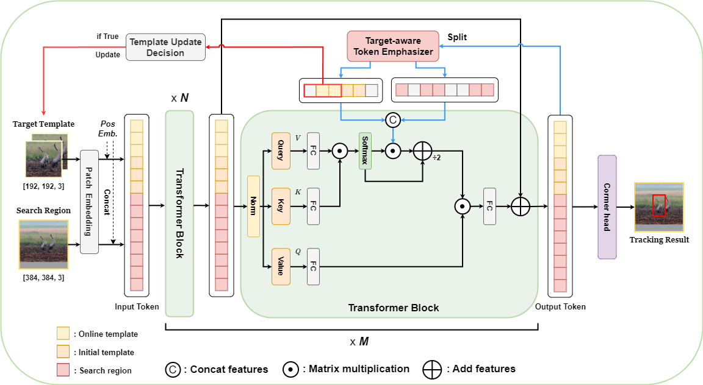

# TETrack

TETrack: Target-aware Token Emphasis for Visual Object Tracking



## News

**[Jan 17, 2024]**

- We release Code, models and raw results.


## Highlights
### :sparkles: Target-aware Token Emphasis tracking framework
TETrack is composed of a **target-aware token emphasizer (TE) based backbone**, a simple corner head, and a target template update decision module.


### :sparkles: Strong performance
| Tracker | GOT-10K* (AO)| TrackingNet (AUC)| LaSOT (AUC)|
|---|---|---|---|
|**TETrack-L**|**75.7**|**85.2**|**72.3**|
|TATrack-L (AAAI23)|-|85.0|71.1|
|OSTrack-B384 (ECCV22)|73.7|83.9|71.1|
|MixFormer-L (CVPR22)|-|83.9|70.1|
|ToMP101 (CVPR22)|-|81.2|-|67.6|
|SBT-B (CVPR22)|69.9|-|65.9|
|AiATrack (ECCV22)|69.6|82.7|69.0|
|SwinTrack (NeurIPS22)|69.4|82.5|69.6|
|STARK (ICCV21)|68.8|82.0|67.1|
|KeepTrack (ICCV21)|-|-|67.1|
|TransT (CVPR21)|67.1|81.4|64.9|

## Install the environment
Use the Anaconda
```
conda create -n TETrack_env python>=3.7
conda activate TETrack_env
bash install_pytorch17.sh
```

## Data Preparation
Put the tracking datasets in ./data. It should look like:
   ```
   ${MixFormer_ROOT}
    -- data
        -- lasot
            |-- airplane
            |-- basketball
            |-- bear
            ...
        -- got10k
            |-- test
            |-- train
            |-- val
        -- coco
            |-- annotations
            |-- train2017
        -- trackingnet
            |-- TRAIN_0
            |-- TRAIN_1
            ...
            |-- TRAIN_11
            |-- TEST
   ```
## Set project paths
Run the following command to set paths for this project
```
python tracking/create_default_local_file.py --workspace_dir . --data_dir ./data --save_dir .
```
After running this command, you can also modify paths by editing these two files
```
lib/train/admin/local.py  # paths about training
lib/test/evaluation/local.py  # paths about testing
```

## Train TETrack
Training with multiple GPUs using DDP. More details of 
training settings can be found at ```tracking/train_tetrack_vit.sh``` .
```
# TETrack with ViT backbone
bash tracking/train_tetrack_vit.sh
```

## Test and evaluate MixFormer on benchmarks

- LaSOT/GOT10k-test/TrackingNet. More details of 
test settings can be found at ```tracking/test_tetrack_vit.sh```
```
bash tracking/test_tetrack_vit.sh
```

## Compute FLOPs/Params and test speed
```
bash tracking/profile_tetrack.sh
```

## Contact
Minho Park: qkdkralsgh12@gmail.com 

